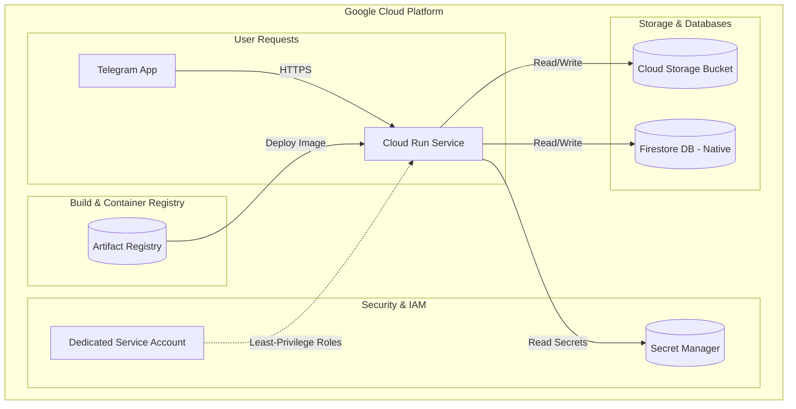

# Influencer Platform Backend GCP Infrastructure

This directory contains the Python Pulumi project to provision the Google Cloud Platform (GCP) infrastructure for the Influencer Platform backend. 

The architecture is designed to be modular, production-ready, highly secure, and easy to extend.

## 🏗️ Architecture Overview



The infrastructure provisions the following resources:
*   **Artifact Registry**: Docker repository to store application container images.
*   **Cloud Run**: Auto-scaling, public HTTPS container backend hosting the FastAPI bot application.
*   **Cloud Storage**: Private bucket with Lifecycle Management rules to store images received/processed by the bot.
*   **Firestore**: Native mode Firestore database for user states and storage.
*   **Secret Manager**: Stores the Telegram bot token and OpenAI API key securely, mounted directly to Cloud Run as environment variables.
*   **IAM policies**: Dedicated service account for Cloud Run limiting access exclusively to the bucket, specific secrets, and Firestore database.

---

## 🛠️ Prerequisites

Before you deploy the infrastructure, ensure you have the following installed on your machine:

1.  [Python 3.9+](https://www.python.org/downloads/)
2.  [Pulumi CLI](https://www.pulumi.com/docs/get-started/install/)
3.  [Google Cloud SDK (gcloud)](https://cloud.google.com/sdk/docs/install)
4.  [Docker](https://docs.docker.com/get-docker/) (if building and pushing images)

---

## 🔑 Authentication

You need to authorize the `gcloud` CLI and set up application default credentials so Pulumi can provision resources on your behalf.

Run the following commands in your terminal:

```bash
# Log in to Google Cloud CLI
gcloud auth login

# Set up Application Default Credentials (ADC) for Pulumi
gcloud auth application-default login
```

Ensure the user account has `Owner` or `Editor` + `Security Admin` role in the target GCP project.

---

## ⚙️ Configuration

1.  **Initialize the Stack**:
    From this directory, run:
    ```bash
    pulumi stack init dev
    ```

2.  **Configure GCP Settings**:
    Replace `your-project-id` with your actual GCP Project ID:
    ```bash
    pulumi config set gcp:project your-project-id
    pulumi config set gcp:region us-central1
    ```

3.  **Configure Resource Names**:
    Specify the bucket and registry repository names:
    ```bash
    pulumi config set storage_bucket_name my-influencer-platform-images
    pulumi config set artifact_registry_repo_name influencer-platform-repo
    ```

4.  **Configure Secrets (Encrypted)**:
    Set the Telegram Bot Token and OpenAI API Key securely. Pulumi will encrypt these values:
    ```bash
    pulumi config set telegram_bot_token "123456:ABC-DEF..." --secret
    pulumi config set openai_api_key "sk-proj-..." --secret
    ```

> [!NOTE]
> Setting optional configuration parameters (like Cloud Run resources) can be done with:
> ```bash
> pulumi config set cloud_run_max_instances 5
> pulumi config set cloud_run_memory "512Mi"
> pulumi config set cloud_run_cpu "1"
> ```

---

## 🚀 Deployment

Run the preview command to see what resources will be created:

```bash
pulumi preview
```

If everything looks correct, deploy the infrastructure:

```bash
pulumi up
```

> [!TIP]
> On the first deployment, Cloud Run will deploy using a standard Google hello-world placeholder image (`us-docker.pkg.dev/cloudrun/container/hello`). Once your application image is pushed to the newly created Artifact Registry, you can update the image parameter (see below).

---

## 🐳 Building and Updating the Docker Image

Once the infrastructure is successfully deployed, follow these steps to build your custom FastAPI application and deploy it to the Cloud Run service.

### 1. Authenticate Docker with your Artifact Registry

Enable Docker authentication for your Artifact Registry region (replace `us-central1` with your region):

```bash
gcloud auth configure-docker us-central1-docker.pkg.dev
```

### 2. Build and Tag the Container Image

Navigate to your application root directory containing your `Dockerfile`, and build the image.

Use the output of `artifact_registry_repository` from Pulumi (or construct it as shown):
Format: `<REGION>-docker.pkg.dev/<PROJECT_ID>/<REPO_NAME>/influencer-platform-backend:latest`

```bash
docker build -t us-central1-docker.pkg.dev/your-project-id/influencer-platform-repo/influencer-platform-backend:latest .
```

### 3. Push the Image to Artifact Registry

```bash
docker push us-central1-docker.pkg.dev/your-project-id/influencer-platform-repo/influencer-platform-backend:latest
```

### 4. Update Pulumi to Deploy your Container

Configure Pulumi to point to your new image and update the stack:

```bash
pulumi config set cloud_run_image us-central1-docker.pkg.dev/your-project-id/influencer-platform-repo/influencer-platform-backend:latest
pulumi up
```

---

## 🗑️ Destroying the Infrastructure

To tear down all provisioned resources and avoid ongoing charges:

```bash
pulumi destroy
```

> [!CAUTION]
> The Cloud Storage bucket is created with `force_destroy=False`. If it contains user images, the destroy command will fail to protect your data. You must manually empty the bucket or set `force_destroy=True` in `modules/storage.py` before running `pulumi destroy`.
